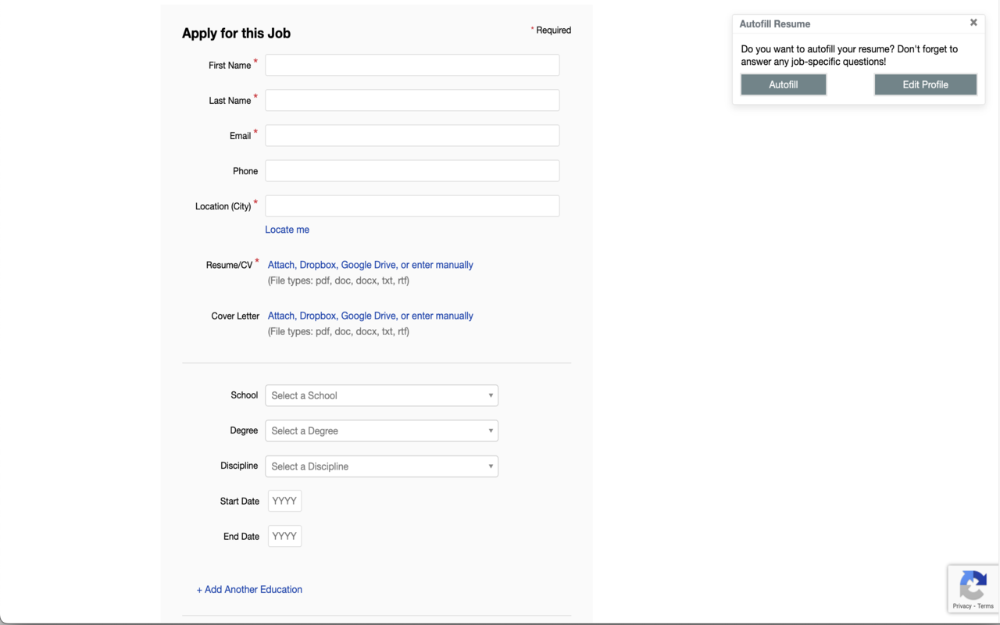
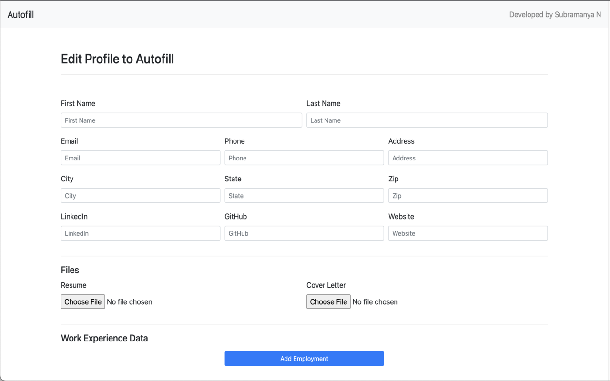

#  Chrome Extension to Autofill job forms

## Installation setup 
### Step 1.
```
 1. git clone https://github.com/subramanya1997/Autofill.git local_folder
```
### Step 2.
Inside chrome
```
 1. Goto chrome://extensions/
 2. Enable Developer Mode
 3. Click on load unpacked
 4. select root directory of local_folder
```

## File System
```
|- assets
    |- data.json : Current test data. 
|- js <br>
    |- autofill.js : logic for autofill
    |- companyData.js : get company data from url
    |- userData.js : get user data from file or storage
    |- manager.js : handels exection and data flow
    |- background.js : triggers when the button is clicked
|- manifest.json : config of the chrome extension  
```

## To-do
* [x] Autofill text
* [x] Autofill Checkbox
* [x] Autofill Select
* [x] Upload resume (Works for greenhouse, lever)
* [x] Upload cover letter (Works for greenhouse, lever)
* [x] Save data in local chome storage (Mainly din't want to collect data from users)
* [ ] Add education (Works for greenhouse)<br>

## Screenshots

1. Popup


2. Edit Profile
